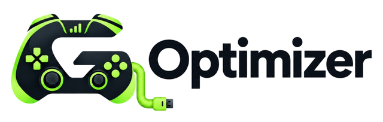

# GLO Brand Policy

<picture>
  <source media="(prefers-color-scheme: dark)" srcset="docs/assets/glo-wordmark-light-640.png">
  
</picture>

GLO (Game Latency Optimizer) is open-source software with a separately managed official service and identity. The MIT license in `LICENSE` grants broad rights to the software code. It does **not** authorize a fork, relay, service, installer, website, social account, or commercial offering to impersonate the official GLO project or official GLO service.

## Official identifiers

Current official public identifiers are:

- Website: `https://gloptimizer.com`
- Official service API: `https://api.gloptimizer.com`
- Source repository: `https://github.com/sonictype41/Game-Latency-Optimizer`
- Project names: `GLO` and `Game Latency Optimizer`
- Project logo: the controller-shaped **G** mark and G Optimizer wordmark distributed with the project

These identifiers are separate from the rights granted to the software under MIT.

## Allowed

You may, when accurate:

- preserve copyright and license notices required by the MIT license;
- say that a project is a **fork of GLO**, **based on GLO**, or **compatible with a documented GLO protocol**;
- link to the official repository or website for factual attribution;
- quote the GLO name when discussing, reviewing, comparing, or documenting the project.

These uses must not imply sponsorship, endorsement, official status, or operation by the GLO project when none exists.

## Independent forks and services

Modified distributions and independently operated relay/services should use their **own primary name and logo** and clearly identify their operator.

Unless expressly authorized by the official project operator, an independent deployment must not:

- call itself **Official GLO**, **GLO Official Service**, or a confusingly similar official-service name;
- use the official GLO logo as the primary identity of a modified product or independent service;
- copy official verification badges, support identities, release-channel identity, domains, packaging, or presentation in a way likely to confuse users;
- claim that GLO endorses, audits, operates, guarantees, or supports the independent deployment.

If the GLO logo is shown for attribution, it should be secondary to the independent project's own identity and accompanied by a clear statement that the deployment is independent.

## Not permitted

Do not use GLO branding to:

- distribute malware, credential stealers, phishing pages, deceptive installers, or intentionally abusive relays;
- hide the true operator of a service;
- evade official service restrictions while presenting the activity as sanctioned by GLO;
- resell or advertise independent access as an official GLO paid product or official-network entitlement without permission;
- impersonate official support, source releases, social identities, domains, or update channels.

## Software rights remain separate

This policy does not modify the MIT license. A fork keeps the software rights granted by MIT while still being expected to avoid false or confusing claims of official affiliation.

For questions or impersonation reports, use the support contact published at `https://gloptimizer.com`.
